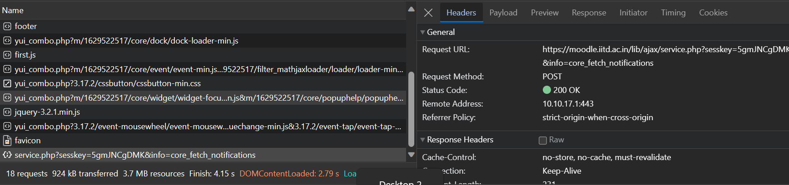
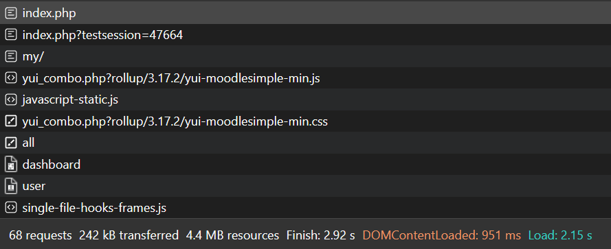
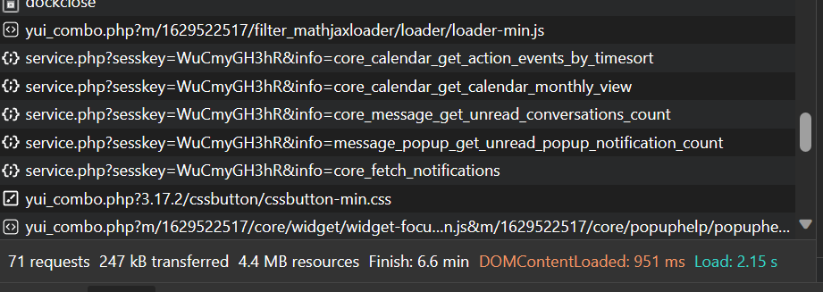

## Report on Moodle's network interactions
- While on login page, _18_ requests were encountered. _17_ requests were GET requests for moodle page. _1_ POST request for session key.

- As soon as I write the password and hit enter, this happens.  
  
- First request is a POST request, with the **payload as my kerberos creds**.
- Second request is a GET request for session_id.
- Then bunch of GET requests to load moodle webpage html/js
 - Then some puzzling php POST messages, look like acks, but not sure.
